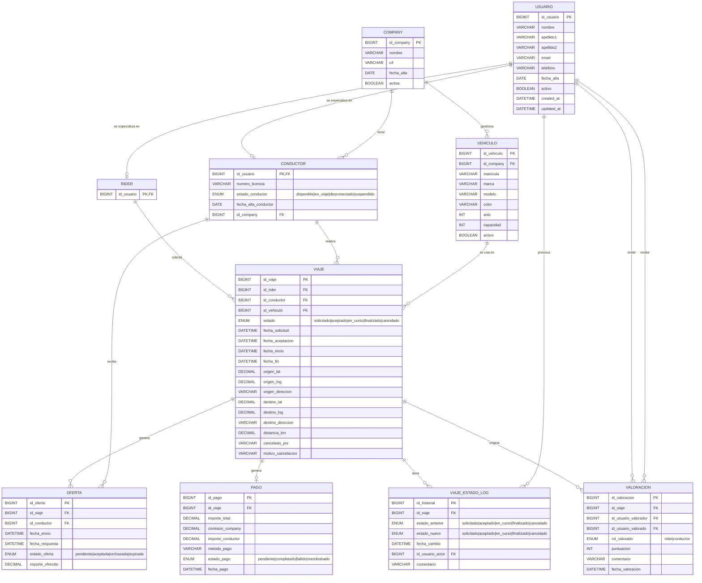

# Modelo Entidad-Relación (MER)

En esta sección se presenta el modelo ER del sistema de ride-hailing. Este modelo recoge las entidades principales del dominio, sus atributos y las relaciones entre ellas.

