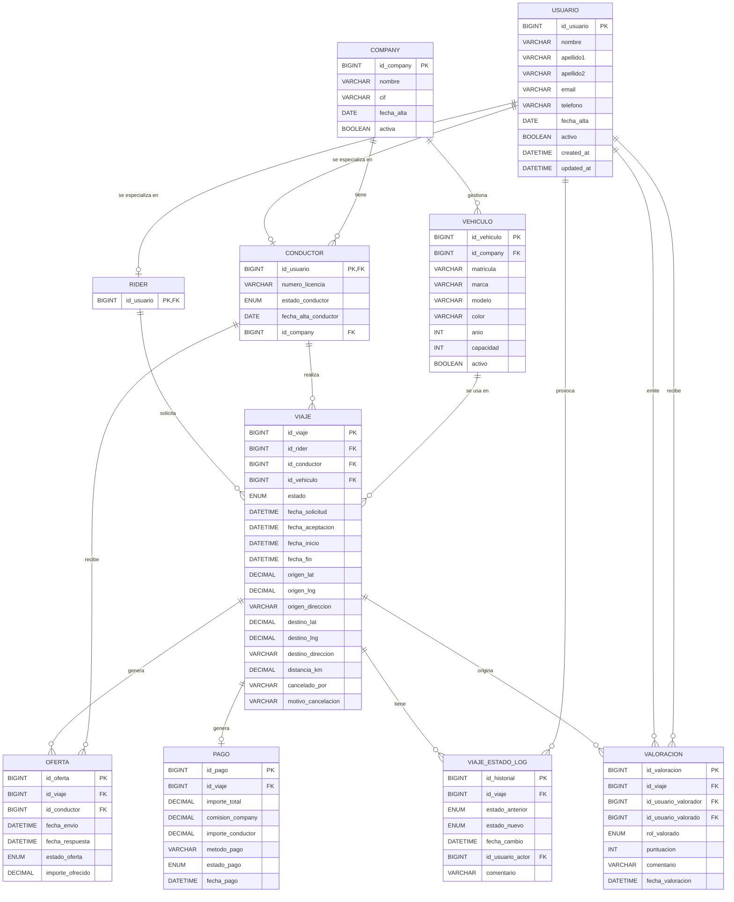

# Modelo Entidad-Relación (MER)

En esta sección se presenta el modelo ER del sistema de ride-hailing. Este modelo recoge las entidades principales del dominio, sus atributos y las relaciones entre ellas.

---
# Dominios de atributos

En el modelo conceptual, los atributos de tipo estado o rol se consideran atributos con dominio finito. Estos dominios se implementarán en el modelo lógico mediante tipos ENUM de MySQL.

### Estado del conductor (CONDUCTOR.estado_conductor)

#### Dominio:

- disponible
- en_viaje
- desconectado
- suspendido

### Estado del viaje (VIAJE.estado)

#### Dominio:

- solicitado
- aceptado
- en_curso
- finalizado
- cancelado

Este atributo define implícitamente una máquina de estados, cuyas transiciones válidas deberán ser controladas mediante lógica de aplicación o procedimientos almacenados.

### Estado de la oferta (OFERTA.estado_oferta)

#### Dominio:

- pendiente
- aceptada
- rechazada
- expirada

Para cada viaje, como máximo una oferta puede alcanzar el estado aceptada. Esta restricción no se garantiza a nivel del modelo conceptual, sino mediante control transaccional.

### Estado del pago (PAGO.estado_pago)

#### Dominio:

- pendiente
- completado
- fallido
- reembolsado

### Estados en historial de viaje (VIAJE_ESTADO_LOG)

#### Dominios:

- estado_anterior
- estado_nuevo

Ambos comparten el mismo dominio que VIAJE.estado:

- solicitado
- aceptado
- en_curso
- finalizado
- cancelado

### Rol valorado (VALORACION.rol_valorado)

#### Dominio:

- rider
- conductor

# Notas de diseño
La entidad USUARIO actúa como superentidad, especializándose en RIDER y CONDUCTOR. Esta decisión permite evitar redundancia en atributos comunes y centralizar la identidad del sistema.

La entidad OFERTA representa las propuestas de viaje enviadas a los conductores. Un viaje puede tener varias ofertas, pero solo una puede ser aceptada, lo cual se controla mediante transacciones.

La entidad VIAJE_ESTADO_LOG permite mantener trazabilidad completa sobre los cambios de estado de los viajes, separando el estado actual de su evolución histórica.

La entidad VALORACION referencia dos veces a USUARIO, puesto que una valoración implica dos roles distintos: el usuario que la emite y el usuario que la recibe, en este caso rider y conductor, respectivamente.

Los dominios de tipo estado no se modelan como entidades independientes en el MER, sino como atributos con valores específicos, ya que no tienen identidad propia ni relaciones adicionales en el dominio.
