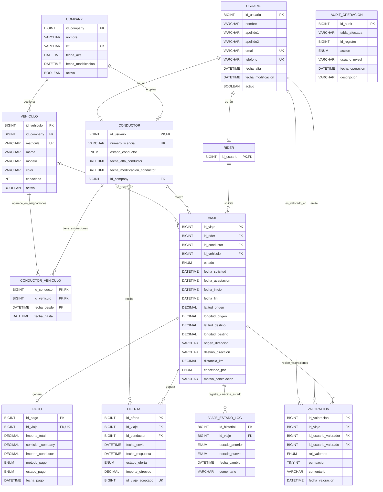

# DISEÑO DE LA BASE DE DATOS

## 1. Docker

Para desplegar la base de datos se ha usado Docker Compose. El objetivo es poder levantar MySQL 8 de forma sencilla y reproducible, sin depender de una instalación local.

El servicio principal es `mysql`, basado en la imagen oficial `mysql:8.0`:

```yaml
services:
  mysql:
    image: mysql:8.0
    container_name: mysql8
```

Se ha fijado el nombre del contenedor como mysql8 para facilitar comandos de administración, por ejemplo:

```
docker exec -it mysql8 mysql -uroot -p
```

También se ha configurado:

```
restart: unless-stopped
```

Con esto, Docker reinicia el contenedor si se detiene inesperadamente, salvo que se haya parado manualmente.

### 1.1 Puerto de conexión

Se publica el puerto estándar de MySQL:

```
ports:
  - "3306:3306"
```

Esto permite conectarse a la base de datos desde la máquina local usando `127.0.0.1:3306`.

### 1.2 Variables de entorno

Las credenciales iniciales no se escriben directamente en el `compose.yml`, sino en un archivo `.env`:

```
MYSQL_ROOT_PASSWORD=rootpass
MYSQL_DATABASE=ride_hailing
MYSQL_USER=app_user
MYSQL_PASSWORD=app_password
```

Y en el `compose.yml` se usan así:

```
environment:
  MYSQL_ROOT_PASSWORD: ${MYSQL_ROOT_PASSWORD}
  MYSQL_DATABASE: ${MYSQL_DATABASE}
  MYSQL_USER: ${MYSQL_USER}
  MYSQL_PASSWORD: ${MYSQL_PASSWORD}
```

Con esto se crea inicialmente la base de datos `ride_hailing` y un usuario básico `app_user`. Los roles y permisos específicos del proyecto se definen después en los scripts SQL.

### 1.3 Persistencia de datos

Se usa un volumen de Docker para guardar los datos de MySQL:

```
volumes:
  - mysql_data:/var/lib/mysql
```

Así, si el contenedor se borra o se recrea, los datos no se pierden mientras se mantenga el volumen `mysql_data`.

### 1.4 Configuración personalizada

También se monta una carpeta local de configuración:

```
- ./mysql/conf.d:/etc/mysql/conf.d:ro
```

Esta carpeta permite añadir archivos .cnf con configuración personalizada de MySQL. Se monta en modo solo lectura (`:ro`) para evitar modificaciones accidentales desde el contenedor.

### 1.5 Healthcheck

Se ha añadido un healthcheck para comprobar que MySQL está listo para aceptar conexiones:

```
healthcheck:
  test: ["CMD-SHELL", "mysqladmin ping -h 127.0.0.1 -uroot -p$${MYSQL_ROOT_PASSWORD}"]
  interval: 10s
  timeout: 5s
  retries: 10
```
Esto evita considerar el contenedor como operativo antes de que el servidor MySQL haya terminado de arrancar.

## 2. Tabla entidad-relación

### 2.1 Diagrama Entidad-Relación (MER)

El siguiente diagrama ilustra la arquitectura de datos, destacando las relaciones de cardinalidad, la especialización de usuarios y el flujo de los viajes y pagos.



### 2.2 Descripción de tablas

#### `company`

La tabla `company` almacena las empresas o flotas que operan dentro de la plataforma. Cada conductor y cada vehículo pertenecen a una compañía.

Su clave primaria es `id_company`, generada automáticamente. Además, el campo `cif` tiene una restricción `UNIQUE`, de forma que no pueden existir dos compañías con el mismo identificador fiscal.

Incluye campos de control como `fecha_alta`, `fecha_modificacion` y `activo`, que permiten registrar cuándo se creó la compañía, cuándo se modificó por última vez y si sigue operativa en el sistema.

#### `usuario`

La tabla `usuario` almacena la información común de todas las personas registradas en el sistema, independientemente de si actúan como riders o como conductores.

Su clave primaria es `id_usuario`. Los campos `email` y `telefono` tienen restricciones `UNIQUE`, ya que identifican datos personales que no deben repetirse entre usuarios.

Esta tabla centraliza los datos personales básicos para evitar duplicidad. A partir de ella se especializan los usuarios mediante las tablas `rider` y `conductor`.

#### `rider`

La tabla `rider` representa a los usuarios que pueden solicitar viajes.

Su clave primaria es `id_usuario`, que también es clave foránea hacia `usuario(id_usuario)`. Esto implementa una relación de especialización: un rider siempre debe existir previamente como usuario.

La acción referencial `ON DELETE RESTRICT` impide borrar un usuario si está registrado como rider, protegiendo la integridad de los viajes asociados.

#### `conductor`

La tabla `conductor` representa a los usuarios que pueden recibir ofertas y realizar viajes.

Su clave primaria es `id_usuario`, que también referencia a `usuario(id_usuario)`. Además, cada conductor pertenece obligatoriamente a una compañía mediante `id_company`, clave foránea hacia `company(id_company)`.

El campo `numero_licencia` es único, ya que identifica de forma individual al conductor desde el punto de vista operativo. El campo `estado_conductor` permite controlar su disponibilidad mediante los valores `disponible`, `en_viaje`, `desconectado` y `suspendido`.

La tabla incluye índices sobre `id_company` y `estado_conductor`, porque son columnas frecuentes en consultas operativas, especialmente para localizar conductores disponibles por empresa o estado.

#### `vehiculo`

La tabla `vehiculo` almacena los vehículos gestionados por las compañías.

Su clave primaria es `id_vehiculo`. Cada vehículo pertenece a una compañía mediante `id_company`, que referencia a `company(id_company)`.

La matrícula se define como única mediante `uk_vehiculo_matricula`, ya que identifica de forma natural al vehículo. La columna `capacidad` tiene una restricción `CHECK` que obliga a que su valor sea mayor que cero, evitando datos imposibles.

El campo `activo` permite distinguir vehículos operativos de vehículos dados de baja sin necesidad de eliminarlos físicamente.

#### `conductor_vehiculo`

La tabla `conductor_vehiculo` resuelve la relación muchos a muchos entre conductores y vehículos.

Un conductor puede tener asignados distintos vehículos a lo largo del tiempo, y un mismo vehículo puede haber sido utilizado por distintos conductores. Por eso se utiliza una tabla intermedia con las columnas `id_conductor`, `id_vehiculo`, `fecha_desde` y `fecha_hasta`.

La clave primaria compuesta está formada por `id_conductor`, `id_vehiculo` y `fecha_desde`, lo que permite registrar varias asignaciones históricas entre el mismo conductor y el mismo vehículo en momentos diferentes.

Cuando `fecha_hasta` es `NULL`, la asignación se considera vigente. Los índices sobre `(id_conductor, fecha_hasta)` y `(id_vehiculo, fecha_hasta)` ayudan a localizar rápidamente las asignaciones activas.

#### `viaje`

La tabla `viaje` representa el ciclo de vida completo de un trayecto solicitado por un rider.

Su clave primaria es `id_viaje`. Cada viaje pertenece obligatoriamente a un rider mediante `id_rider`, que referencia a `rider(id_usuario)`.

Las columnas `id_conductor` y `id_vehiculo` son opcionales porque un viaje puede existir inicialmente en estado `solicitado`, antes de que haya sido aceptado por un conductor. Cuando el viaje es aceptado, se asignan el conductor y el vehículo correspondientes.

El campo `estado` controla la evolución del viaje mediante los valores `solicitado`, `aceptado`, `en_curso`, `finalizado` y `cancelado`.

La tabla también almacena fechas relevantes del ciclo de vida del viaje: solicitud, aceptación, inicio y fin. Además, guarda coordenadas y direcciones de origen y destino.

Se incluyen restricciones `CHECK` para validar que las latitudes estén entre `-90` y `90`, las longitudes entre `-180` y `180`, y que la distancia no sea negativa.

Los índices sobre estado, conductor y rider permiten optimizar consultas frecuentes, como buscar viajes por estado, historial de un conductor o historial de un rider.

#### `oferta`

La tabla `oferta` almacena las ofertas enviadas a los conductores para un viaje.

Cada oferta pertenece a un viaje mediante `id_viaje` y a un conductor mediante `id_conductor`. La restricción `UNIQUE (id_viaje, id_conductor)` impide que el mismo conductor reciba dos veces la misma oferta para el mismo viaje.

El campo `estado_oferta` permite controlar si la oferta está `pendiente`, `aceptada`, `rechazada` o `expirada`.

Para garantizar que solo pueda existir una oferta aceptada por viaje, se utiliza la columna generada `id_viaje_aceptado`. Esta columna solo toma valor cuando la oferta está aceptada. Sobre ella se define una restricción `UNIQUE`, aprovechando que MySQL permite múltiples valores `NULL` en una restricción única.

De esta forma, pueden existir muchas ofertas pendientes, rechazadas o expiradas para un viaje, pero solo una oferta aceptada.

#### `pago`

La tabla `pago` almacena la liquidación económica de un viaje finalizado.

Su clave primaria es `id_pago`. La columna `id_viaje` es clave foránea hacia `viaje(id_viaje)` y además tiene una restricción `UNIQUE`, lo que garantiza que cada viaje pueda tener como máximo un pago asociado.

La tabla registra el importe total pagado, la comisión de la compañía y el importe correspondiente al conductor. La restricción `ck_pago_sumas` comprueba que el total sea coherente con la suma de la comisión y el importe del conductor, admitiendo una pequeña tolerancia por redondeos.

También se validan importes no negativos mediante restricciones `CHECK`.

El campo `metodo_pago` limita los métodos permitidos a `tarjeta_credito`, `efectivo` y `wallet`, mientras que `estado_pago` controla si el pago está `pendiente`, `completado`, `fallido` o `reembolsado`.

#### `valoracion`

La tabla `valoracion` almacena las valoraciones emitidas por los usuarios tras un viaje.

Cada valoración se asocia a un viaje mediante `id_viaje`. Además, registra quién emite la valoración con `id_usuario_valorador` y quién la recibe con `id_usuario_valorado`.

El campo `rol_valorado` indica si el usuario valorado actúa como `rider` o como `conductor`. La puntuación se restringe mediante un `CHECK` para que solo pueda tomar valores entre 1 y 5.

Esta tabla permite que un viaje genere valoraciones en ambos sentidos: del rider al conductor y del conductor al rider.

El índice sobre `(id_usuario_valorado, fecha_valoracion)` facilita consultas de reputación, rankings o evolución temporal de las puntuaciones.

#### `viaje_estado_log`

La tabla `viaje_estado_log` registra el historial de cambios de estado de los viajes.

Cada fila almacena el viaje afectado, el estado anterior, el nuevo estado, la fecha del cambio y un comentario descriptivo.

Esta tabla se alimenta automáticamente mediante el trigger `tr_audit_viaje_estado`, que inserta un registro cada vez que el campo `estado` de un viaje cambia realmente.

Su objetivo es proporcionar trazabilidad funcional del ciclo de vida de los viajes.

#### `audit_operacion`

La tabla `audit_operacion` almacena una auditoría general de operaciones relevantes sobre la base de datos.

A diferencia de `viaje_estado_log`, que se centra únicamente en cambios de estado de viajes, esta tabla registra operaciones más generales sobre viajes, ofertas y pagos.

Cada registro incluye la tabla afectada, el identificador del registro, la acción realizada, el usuario MySQL que ejecutó la operación, la fecha y una descripción.

Esta tabla no tiene claves foráneas directas hacia las tablas auditadas, porque usa un modelo genérico basado en `tabla_afectada` e `id_registro`. Esto permite auditar operaciones de distintas tablas dentro de una misma estructura.

## 3. Roles y permisos

La seguridad de la base de datos se ha organizado mediante roles de MySQL. En lugar de conceder permisos directamente a cada usuario, se definen roles con permisos concretos y después se asignan esos roles a usuarios específicos.

El objetivo principal es aplicar el principio de mínimos privilegios: cada usuario solo debe tener los permisos necesarios para cumplir su función.

### 3.1 Vistas de seguridad y operación

Antes de definir los roles, el script `permissions.sql` crea varias vistas. Estas vistas permiten controlar qué información puede consultar cada tipo de usuario, evitando dar acceso directo a todas las tablas.

Las vistas creadas son:

| Vista | Finalidad |
| --- | --- |
| `v_usuarios_anonimizados` | Permite consultar usuarios sin mostrar datos sensibles como `email` o `telefono`. |
| `v_pagos_analitica` | Permite consultar información económica de los pagos para análisis. |
| `v_viaje_estado_log_resumen` | Muestra el historial de cambios de estado de los viajes. |
| `v_auditoria_operaciones` | Permite revisar operaciones auditadas sin acceder directamente a `audit_operacion`. |
| `v_conductores_disponibles` | Muestra conductores activos y disponibles para la operativa de la aplicación. |
| `v_viajes_operativos` | Muestra información operativa de los viajes. |
| `v_ofertas_operativas` | Muestra información operativa de las ofertas. |

El uso de vistas permite separar el acceso funcional del acceso directo a las tablas base. Así, por ejemplo, un analista puede consultar datos útiles para informes sin acceder a información personal completa de los usuarios.

### 3.2 Roles definidos

En el script se crean cinco roles principales:

```sql
CREATE ROLE IF NOT EXISTS 'rol_admin';
CREATE ROLE IF NOT EXISTS 'rol_app';
CREATE ROLE IF NOT EXISTS 'rol_analista';
CREATE ROLE IF NOT EXISTS 'rol_backup';
CREATE ROLE IF NOT EXISTS 'rol_readonly';
```

Cada rol representa un perfil distinto dentro del sistema.

#### `rol_admin`

El rol `rol_admin` tiene control total sobre el esquema `ride_hailing`:

```sql
GRANT ALL PRIVILEGES ON ride_hailing.* TO 'rol_admin';
```

Está pensado para tareas de administración, mantenimiento y gestión completa de la base de datos. Es el rol con más permisos, por lo que no debe usarse para la aplicación ni para consultas normales.

Usuario asociado:

```sql
'admin_user'@'%'
```

#### `rol_app`

El rol `rol_app` está pensado para el usuario que utiliza la aplicación backend.

Este rol puede consultar vistas operativas:

```sql
v_conductores_disponibles
v_viajes_operativos
v_ofertas_operativas
```

También puede insertar valoraciones directamente en la tabla `valoracion`:

```sql
GRANT INSERT ON ride_hailing.valoracion TO 'rol_app';
```

Sin embargo, no tiene permisos directos para modificar tablas críticas como `viaje`, `oferta` o `pago`. Las operaciones principales del negocio se hacen mediante procedimientos almacenados:

```sql
sp_solicitar_viaje
sp_aceptar_oferta
sp_iniciar_viaje
sp_finalizar_viaje_y_pagar
```

Esto es importante porque obliga a que la aplicación use la lógica controlada de la base de datos. Así, la aceptación de ofertas, el cambio de estado de viajes y la generación de pagos se realizan mediante procedimientos que incluyen validaciones, transacciones y control de concurrencia.

Usuario asociado:

```sql
'backend_user'@'%'
```

#### `rol_analista`

El rol `rol_analista` está pensado para consultas de análisis, métricas e informes.

Tiene permisos de solo lectura sobre vistas preparadas para analítica:

```sql
v_usuarios_anonimizados
v_pagos_analitica
v_viaje_estado_log_resumen
v_viajes_operativos
v_auditoria_operaciones
```

Este rol permite consultar información útil para el análisis del sistema, pero sin acceder directamente a datos personales sensibles ni modificar información.

Usuario asociado:

```sql
'analyst_user'@'%'
```

#### `rol_readonly`

El rol `rol_readonly` permite consultar información general del sistema sin capacidad de escritura.

Tiene acceso de lectura a vistas operativas, analíticas y de auditoría:

```sql
v_usuarios_anonimizados
v_conductores_disponibles
v_viajes_operativos
v_ofertas_operativas
v_pagos_analitica
v_viaje_estado_log_resumen
v_auditoria_operaciones
```

Este rol está pensado para usuarios que solo necesitan revisar datos, por ejemplo para soporte, supervisión o consultas funcionales.

Usuario asociado:

```sql
'readonly_user'@'%'
```

#### `rol_backup`

El rol `rol_backup` está pensado para realizar copias de seguridad de la base de datos.

Tiene permisos sobre el esquema `ride_hailing` para leer los datos y los objetos necesarios durante un backup lógico:

```sql
SELECT, SHOW VIEW, TRIGGER, EVENT, LOCK TABLES
```

Además, tiene algunos privilegios globales necesarios para tareas de backup y recuperación:

```sql
RELOAD, PROCESS, REPLICATION CLIENT
```

Estos permisos permiten realizar copias con herramientas como `mysqldump`, incluyendo vistas, triggers y otros objetos relevantes.

Usuario asociado:

```sql
'backup_user'@'%'
```

### 3.3 Usuarios creados

El script crea un usuario para cada rol:

| Usuario         | Rol asignado   | Finalidad                                        |
| --------------- | -------------- | ------------------------------------------------ |
| `admin_user`    | `rol_admin`    | Administración completa del esquema.             |
| `backend_user`  | `rol_app`      | Usuario utilizado por la aplicación backend.     |
| `analyst_user`  | `rol_analista` | Consultas analíticas y métricas.                 |
| `readonly_user` | `rol_readonly` | Consulta general sin permisos de escritura.      |
| `backup_user`   | `rol_backup`   | Realización de backups y soporte a recuperación. |

A cada usuario se le asigna su rol correspondiente mediante `GRANT`:

```sql
GRANT 'rol_app' TO 'backend_user'@'%';
```

Además, se establece el rol como rol por defecto:

```sql
SET DEFAULT ROLE 'rol_app' TO 'backend_user'@'%';
```

Esto permite que el usuario tenga activo su rol automáticamente al iniciar sesión, sin tener que ejecutar manualmente `SET ROLE`.

### 3.4 Justificación del diseño de seguridad

El diseño de permisos se basa en tres decisiones principales.

Primero, se separan las responsabilidades. Cada usuario tiene una función concreta: administración, aplicación, análisis, consulta o backup.

Segundo, se aplica el principio de mínimos privilegios. Por ejemplo, el usuario de la aplicación no tiene permisos totales sobre la base de datos, sino solo los necesarios para consultar vistas, insertar valoraciones y ejecutar procedimientos almacenados.

Tercero, se usan vistas para controlar la exposición de datos. Los usuarios de análisis y solo lectura no acceden directamente a todas las tablas, sino a vistas preparadas para su función. Esto permite ocultar información sensible y reducir el riesgo de accesos indebidos.

En conjunto, esta configuración protege las tablas principales del sistema y obliga a que las operaciones críticas se realicen de forma controlada mediante procedimientos almacenados.


## 4. Vistas e Índices

Explicar todas las vistas que se han creado, para qué sirven y quién tiene acceso a ellas.

Explicar los índices que se han creado, por qué se han creado y para qué sirven.

## 5. Procedimientos almacenados y triggers

## 6. Backup

Explicar el RTO decidido, cómo están automatizados los backups y cómo hacemos PITR

## 7. Monitorización

Explicar el sistema de monitorización que hayamos usado.