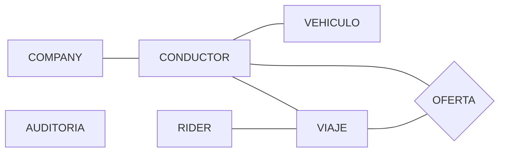

# Diseño de la base de datos

## 1. Entidades

- `rider`: usuario que solicita un viaje.
- `conductor`: conductor que recibe ofertas y puede aceptar o rechazar viajes.
- `company`: empresa a la que pertenece cada conductor.
- `vehiculo`: vehículo asociado a un conductor.
- `viaje`: solicitud o trayecto, con origen y destino geolocalizados, estado, duración, distancia e importe.
- `oferta`: oferta de un viaje enviada a conductores concretos.
- `auditoria`: historial y auditoría básica de operaciones.

Todas estas entidades se han definido a partir del enunciado del ejercicio.

## 2. Relaciones entre entidades

- `company 1:N conductor`: una company puede tener asociados varios conductores.
- `conductor 1:N vehiculo`: un conductor puede tener asociados varios vehículos.
- `rider 1:N viaje`: un rider puede solicitar varios viajes.
- `conductor 1:N viaje`: un conductor puede realizar varios viajes, aunque un viaje puede no tener conductor asignado al inicio.
- `viaje 1:N oferta`: una solicitud de viaje puede generar varias ofertas, pero solo un conductor puede aceptar y quedar asignado al viaje.
- `conductor 1:N oferta`: un conductor puede recibir varias ofertas a lo largo del tiempo.

## 3. Claves y restricciones

- PK numérica autoincremental en cada tabla principal.
- `UNIQUE` en los casos que sean evidentes.
- `NOT NULL` por defecto salvo en casos concretos.
- `DEFAULT` al crear elementos que requieran un valor por defecto inicial.
- FK con `ON DELETE RESTRICT` por defecto, para evitar borrados accidentales.
- Motor `InnoDB`.

### company

- PK: `id_company`
- UNIQUE: `nombre`
- NOT NULL: `nombre`
- DEFAULT: `activo = TRUE`

### conductor

- PK: `id_conductor`
- FK: `id_company -> company`
- UNIQUE: `dni`, `email`
- NOT NULL: `id_company`, `dni`, `nombre`, `email`
- DEFAULT: `activo = TRUE`

### rider

- PK: `id_rider`
- UNIQUE: `email`
- NOT NULL: `nombre`, `email`
- DEFAULT: `activo = TRUE`

### vehiculo

- PK: `id_vehiculo`
- FK: `id_conductor -> conductor`
- UNIQUE: `matricula`
- NOT NULL: `id_conductor`, `matricula`, `marca`, `modelo`
- DEFAULT: `activo = TRUE`

### viaje

- PK: `id_viaje`
- FK: `id_rider -> rider` (obligatoria)
- FK: `id_conductor -> conductor` (nullable al inicio)
- NOT NULL: `id_rider`, `origen_latitud`, `origen_longitud`, `destino_latitud`, `destino_longitud`, `estado`
- DEFAULT: `estado = 'solicitado'`
- DEFAULT: `fecha_solicitud = actual`
- CHECK en `estado`: `solicitado`, `aceptado`, `en_curso`, `finalizado`, `cancelado`
- CHECK en coordenadas:
  - `origen_latitud BETWEEN -90 AND 90`
  - `origen_longitud BETWEEN -180 AND 180`
  - `destino_latitud BETWEEN -90 AND 90`
  - `destino_longitud BETWEEN -180 AND 180`
- CHECK en métricas:
  - `distancia_km >= 0` o `NULL`
  - `duracion_minutos >= 0` o `NULL`
  - `importe_total >= 0` o `NULL`

### oferta

- PK: `id_oferta`
- FK: `id_viaje -> viaje`
- FK: `id_conductor -> conductor`
- UNIQUE: `(id_viaje, id_conductor)`
- NOT NULL: `id_viaje`, `id_conductor`, `estado_oferta`, `fecha_envio`
- DEFAULT: `estado_oferta = 'pendiente'`
- DEFAULT: `fecha_envio = actual`
- CHECK en `estado_oferta`: `pendiente`, `aceptada`, `rechazada`

### auditoria

- PK: `id_auditoria`
- NOT NULL: `entidad`, `id_entidad`, `accion`, `fecha_evento`
- DEFAULT: `fecha_evento = actual`
- CHECK en `accion`: `INSERT`, `UPDATE`, `DELETE`

### Reglas de borrado

- `company -> conductor : ON DELETE RESTRICT`
- `conductor -> vehiculo : ON DELETE RESTRICT`
- `rider -> viaje : ON DELETE RESTRICT`
- `conductor -> viaje : ON DELETE RESTRICT`
- `viaje -> oferta : ON DELETE RESTRICT`
- `conductor -> oferta : ON DELETE RESTRICT`

## 4. Índices

Además de las claves primarias y restricciones `UNIQUE`, se definen índices para mejorar las búsquedas y los `JOIN` más previsibles:

- `conductor(id_company)`
- `vehiculo(id_conductor)`
- `viaje(id_rider)`
- `viaje(id_conductor)`
- `viaje(estado, fecha_solicitud)`
- `oferta(id_conductor, estado_oferta)`
- `oferta(id_viaje, estado_oferta)`
- `auditoria(entidad, id_entidad)`
- `auditoria(fecha_evento)`

## 5. Diagrama Entidad-Relación (simplificado)

