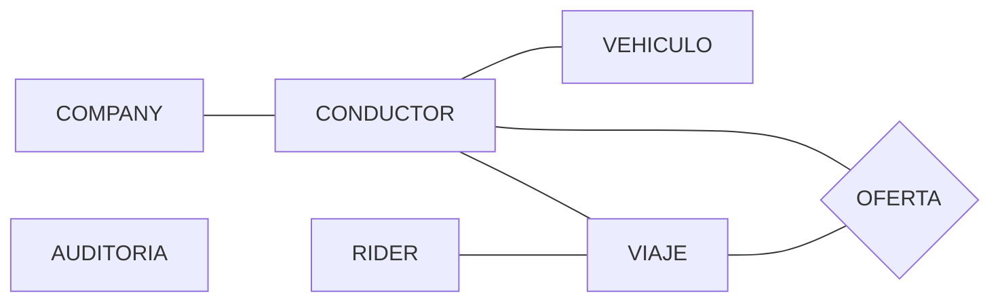

# Diseño de la base de datos

## 1. Entidades

- `rider`: usuario que solicita un viaje.
- `conductor`: conductor que recibe ofertas y puede aceptar o rechazar viajes.
- `company`: empresa a la que pertenece cada conductor.
- `vehiculo`: vehículo asociado a un conductor.
- `viaje`: solicitud o trayecto, con origen y destino geolocalizados, estado, duración, distancia e importe.
- `oferta`: oferta de un viaje enviada a conductores concretos.
- `auditoria`: historial y auditoría básica de operaciones.

Todas estas entidades se han definido a partir del enunciado del ejercicio.

## 2. Relaciones entre entidades

- `company 1:N conductor`: una company puede tener asociados varios conductores.
- `conductor 1:N vehiculo`: un conductor puede tener asociados varios vehículos.
- `rider 1:N viaje`: un rider puede solicitar varios viajes.
- `conductor 1:N viaje`: un conductor puede realizar varios viajes, aunque un viaje puede no tener conductor asignado al inicio.
- `viaje 1:N oferta`: una solicitud de viaje puede generar varias ofertas, pero solo un conductor puede aceptar y quedar asignado al viaje.
- `conductor 1:N oferta`: un conductor puede recibir varias ofertas a lo largo del tiempo.

## 3. Claves y restricciones

- PK numérica autoincremental en cada tabla principal.
- `UNIQUE` en los casos que sean evidentes.
- `NOT NULL` por defecto salvo en casos concretos.
- `DEFAULT` al crear elementos que requieran un valor por defecto inicial.
- FK con `ON DELETE RESTRICT` por defecto, para evitar borrados accidentales.
- Motor `InnoDB`.

### company

- PK: `id_company`
- UNIQUE: `nombre`
- NOT NULL: `nombre`
- DEFAULT: `activo = TRUE`

### conductor

- PK: `id_conductor`
- FK: `id_company -> company`
- UNIQUE: `dni`, `email`
- NOT NULL: `id_company`, `dni`, `nombre`, `email`
- DEFAULT: `activo = TRUE`

### rider

- PK: `id_rider`
- UNIQUE: `email`
- NOT NULL: `nombre`, `email`
- DEFAULT: `activo = TRUE`

### vehiculo

- PK: `id_vehiculo`
- FK: `id_conductor -> conductor`
- UNIQUE: `matricula`
- NOT NULL: `id_conductor`, `matricula`, `marca`, `modelo`
- DEFAULT: `activo = TRUE`

### viaje

- PK: `id_viaje`
- FK: `id_rider -> rider` (obligatoria)
- FK: `id_conductor -> conductor` (nullable al inicio)
- NOT NULL: `id_rider`, `origen_latitud`, `origen_longitud`, `destino_latitud`, `destino_longitud`, `estado`
- DEFAULT: `estado = 'solicitado'`
- DEFAULT: `fecha_solicitud = actual`
- CHECK en `estado`: `solicitado`, `aceptado`, `en_curso`, `finalizado`, `cancelado`
- CHECK en coordenadas:
  - `origen_latitud BETWEEN -90 AND 90`
  - `origen_longitud BETWEEN -180 AND 180`
  - `destino_latitud BETWEEN -90 AND 90`
  - `destino_longitud BETWEEN -180 AND 180`
- CHECK en métricas:
  - `distancia_km >= 0` o `NULL`
  - `duracion_minutos >= 0` o `NULL`
  - `importe_total >= 0` o `NULL`

### oferta

- PK: `id_oferta`
- FK: `id_viaje -> viaje`
- FK: `id_conductor -> conductor`
- UNIQUE: `(id_viaje, id_conductor)`
- NOT NULL: `id_viaje`, `id_conductor`, `estado_oferta`, `fecha_envio`
- DEFAULT: `estado_oferta = 'pendiente'`
- DEFAULT: `fecha_envio = actual`
- CHECK en `estado_oferta`: `pendiente`, `aceptada`, `rechazada`

### auditoria

- PK: `id_auditoria`
- NOT NULL: `entidad`, `id_entidad`, `accion`, `fecha_evento`
- DEFAULT: `fecha_evento = actual`
- CHECK en `accion`: `INSERT`, `UPDATE`, `DELETE`

### Reglas de borrado

- `company -> conductor : ON DELETE RESTRICT`
- `conductor -> vehiculo : ON DELETE RESTRICT`
- `rider -> viaje : ON DELETE RESTRICT`
- `conductor -> viaje : ON DELETE RESTRICT`
- `viaje -> oferta : ON DELETE RESTRICT`
- `conductor -> oferta : ON DELETE RESTRICT`

## 4. Índices

Además de las claves primarias y restricciones `UNIQUE`, se definen índices para mejorar las búsquedas y los `JOIN` más previsibles:

- `conductor(id_company)`
- `vehiculo(id_conductor)`
- `viaje(id_rider)`
- `viaje(id_conductor)`
- `viaje(estado, fecha_solicitud)`
- `oferta(id_conductor, estado_oferta)`
- `oferta(id_viaje, estado_oferta)`
- `auditoria(entidad, id_entidad)`
- `auditoria(fecha_evento)`

## 5. Diagrama Entidad-Relación (simplificado)

## 6. Vistas

Se definen dos vistas simples para reutilizar consultas frecuentes:

- `v_viajes_activos`: muestra los viajes que siguen en estados operativos (`solicitado`, `aceptado`, `en_curso`).
- `v_conductores_activos`: muestra los conductores marcados como activos.

Estas vistas simplifican consultas repetidas y ayudan a separar la lógica de acceso a datos.

## 7. Administración y configuración del SGBD

La base de datos se ejecuta sobre MySQL 8 en Docker, con configuración adicional cargada desde `mysql/conf.d/custom.cnf`. Esta configuración se ha definido para mejorar consistencia, diagnóstico y preparación del entorno para fases posteriores del proyecto.

### 7.1. Configuración aplicada

Se han activado o ajustado los siguientes parámetros en `[mysqld]`:

- `sql_mode=STRICT_TRANS_TABLES,ERROR_FOR_DIVISION_BY_ZERO,NO_ENGINE_SUBSTITUTION`
- `log_error_verbosity=3`
- `slow_query_log=1`
- `long_query_time=0.5`
- `performance_schema=1`
- `innodb_buffer_pool_size=256M`
- `max_connections=200`
- `innodb_flush_log_at_trx_commit=1`
- `log_bin=mysql-bin`
- `sync_binlog=1`
- `binlog_expire_logs_seconds=604800`

### 7.2. Justificación de la configuración

#### Validación estricta

Se utiliza `sql_mode` en modo estricto para evitar inserciones o actualizaciones silenciosamente incorrectas. Esto mejora la consistencia de los datos y encaja con el uso de restricciones como `NOT NULL`, `UNIQUE`, `CHECK` y claves foráneas.

#### Logs y diagnóstico

Se configura `log_error_verbosity=3` para obtener mayor detalle en el log de errores.

Además, se activa `slow_query_log=1` con `long_query_time=0.5` para registrar consultas lentas. Esto permitirá analizar el rendimiento de consultas reales del proyecto en fases posteriores.

#### Instrumentación

Se activa `performance_schema=1` para disponer de métricas internas del servidor, como hilos, esperas y actividad del sistema. Esto será útil más adelante en temas de concurrencia y monitorización.

#### Rendimiento

Se fija `innodb_buffer_pool_size=256M` como valor razonable para un entorno de práctica en Docker, manteniendo un equilibrio entre uso de memoria y caché de InnoDB.

También se define `max_connections=200`, suficiente para una práctica universitaria y útil para comprobar límites y métricas de conexiones.

#### Durabilidad y binary log

Se establece `innodb_flush_log_at_trx_commit=1` para priorizar durabilidad en cada `COMMIT`.

Se activa `log_bin=mysql-bin` y `sync_binlog=1` para que el servidor mantenga binary logs consistentes. Esto deja preparado el entorno para temas posteriores como recuperación, PITR o replicación.

Por último, `binlog_expire_logs_seconds=604800` mantiene los binlogs durante 7 días, evitando crecimiento indefinido en disco.

### 7.3. Administración básica del servidor

Durante esta fase se comprueba el servidor con comandos como:

- `SHOW VARIABLES`
- `SHOW STATUS`
- `SHOW PROCESSLIST`
- `SHOW VARIABLES LIKE '...'`
- `SHOW STATUS LIKE '...'`
- `SHOW BINARY LOGS`
- `SHOW MASTER STATUS`
- `SELECT * FROM performance_schema.threads LIMIT 10`

Estas consultas permiten verificar que la configuración del servidor coincide con la esperada y que MySQL está funcionando correctamente dentro del contenedor.