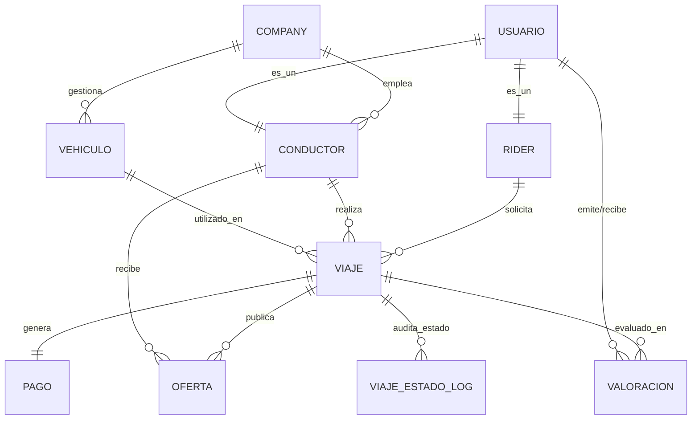

# CÓMO OPERAR SOBRE LA BASE DE DATOS

## 1. Manejar la base de datos usando Docker Compose

### 1.1. Comprobar que tenemos todo lo necesario para hacer uso de docker

```bash
docker --version
docker compose version
```

En caso de tener tanto docker como docker compose instalados en el sistema, vamos con el siguiente paso.

### 1.2. Arrancar el servicio

```bash
# Inicializa el contenedor en segundo plano '-d'
docker compose up -d
# Muestra los contenedores en ejecución
docker compose ps
# Muestra logs
docker compose logs -f mysql
```

Una vez iniciado, podemos comprobar si mysql está listo para ser usado 

```bash
docker exec -it mysql8 mysqladmin ping -h 127.0.0.1 -uroot -prootpass
```

Si como salida de este comando vemos `mysqld is alive` estamos preparados para empezar a trabajar con la base de datos.

## 1.3. Conectarse a la base de datos

### Conectarse desde dentro del contenedor

```bash
docker exec -it mysql8 mysql -uroot -prootpass
```

### Conectarse desde tu máquina

```bash
mysql -h 127.0.0.1 -P 3306 -uroot -p
```

## 1.4. Bajar el proyecto

En caso de que queramos bajar el contenedor, tenemos varias opciones

### Bajar el proyecto sin borrar datos

```bash
docker compose down
```

### Borrar TODO (incluye datos)

```bash
docker compose down -v
```

## 2. Tabla entidad-relación

### 2.1 Diagrama Entidad-Relación (MER)

El siguiente diagrama ilustra la arquitectura de datos, destacando las relaciones de cardinalidad, la especialización de usuarios y el flujo de los viajes y pagos.


### 2.2 Descripción de tablas

#### Tablas maestras y Companies

- `company`: Entidad maestra que almacena los datos de las flotas o empresas proveedoras de transporte.
    - Restricciones: Clave primaria `id_company` (BIGINT). Garantiza la unicidad corporativa mediante la restricción `uk_company_cif` sobre el CIF.
- `usuario`: Entidad central del sistema que almacena los datos personales e información de contacto compartida por cualquier tipo de usuario en la plataforma.
    - Restricciones: Clave primaria `id_usuario` (BIGINT). Posee restricciones de unicidad (`UNIQUE`) tanto para el `email` como para el `telefono`, garantizando que no existan cuentas duplicadas.

#### Especialización de usuarios

El modelo aplica un patrón de especialización 1:1 sobre la tabla usuario para diferenciar roles operativos sin duplicar datos personales.

- `rider`: Subtipo de `usuario` que representa al pasajero.
    - Restricciones: Su clave primaria `id_usuario` actúa simultáneamente como clave foránea hacia la tabla `usuario`, garantizando dependencia existencial (`ON DELETE RESTRICT`).

- `conductor`: Subtipo de `usuario` que representa a los chóferes. Incluye atributos operativos como licencia, estado actual y su vinculación obligatoria a una empresa.
    - Restricciones: Clave foránea hacia `usuario` (herencia) y hacia `company` (empleador). Incluye restricción única para el `numero_licencia` y dispone de índices para optimizar búsquedas por empresa y estado de disponibilidad.

#### Gestión de flota y operativa de viajes

- `vehiculo`: Define el parque móvil disponible en la plataforma.
    - Restricciones: Dependencia directa de una `company` (Clave foránea). Restricción de unicidad para la `matricula` e índices sobre `id_company` para optimizar consultas de inventario.

- `viaje`: Entidad transaccional principal del sistema. Registra todo el ciclo de vida de un trayecto, desde su solicitud inicial hasta la finalización, almacenando coordenadas espaciales, direcciones y marcas de tiempo para cada fase.
    - Restricciones: Depende de un `rider` (obligatorio), y opcionalmente (hasta que se acepta) de un `conductor` y un `vehiculo`. Incluye índices compuestos (`estado` + `fecha_solicitud`) esenciales para el rendimiento de las consultas del dashboard operativo y la distribución de ofertas.

- `oferta`: Tabla transaccional de alta concurrencia que registra las propuestas de viaje enviadas a la flota.
    - Restricciones: Depende de un `viaje` y un `conductor`. Cuenta con una restricción `UNIQUE (id_viaje, id_conductor)` para evitar de forma estricta que un mismo conductor reciba ofertas duplicadas para el mismo trayecto.

#### Economía y Valoraciones 

- `pago`: Registra la liquidación económica exacta de un viaje finalizado.
    - Restricciones: Relación 1:1 con el `viaje` garantizada mediante `UNIQUE (id_viaje)`. Implementa una restricción de comprobación a nivel de base de datos (`CHECK (importe_total = comision_company + importe_conductor)`) para asegurar la integridad contable y evitar descuadres financieros.

- `valoracion`: Permite el feedback bidireccional entre usuarios (Rider a Conductor y viceversa) al concluir un servicio.
    - Restricciones: Relaciones foráneas hacia el `viaje`, el usuario que emite (valorador) y el usuario que recibe (valorado). Asegura la calidad del dato forzando que la puntuación esté en el rango permitido mediante `CHECK (puntuacion BETWEEN 1 AND 5)`.

#### Auditoría

- `viaje_estado_log`: Tabla de trazabilidad inmutable alimentada mediante triggers. Almacena el historial exacto de transiciones de estado de cada viaje para resolución de disputas y analítica.
    - Restricciones: Clave primaria compuesta por `id_historial` y `fecha_cambio`. Clave foránea hacia `viaje` e índice secundario para facilitar la extracción cronológica del ciclo de vida de un trayecto.

## 3. Roles y permisos

Explicar usuarios y roles, por qué se han creado y las funciones que hacen cada uno de ellos.

## 4. Vistas e Índices

Explicar todas las vistas que se han creado, para qué sirven y quién tiene acceso a ellas.

Explicar los índices que se han creado, por qué se han creado y para qué sirven.

## 5. Procedimientos almacenados y triggers

Qué procedimientos almacenados y triggers tenemos, por qué los hemos creado y para qué sirven.

## 6. Backup

Explicar el RTO decidido, cómo están automatizados los backups y cómo hacemos PITR

## 7. Monitorización

Explicar el sistema de monitorización que hayamos usado.